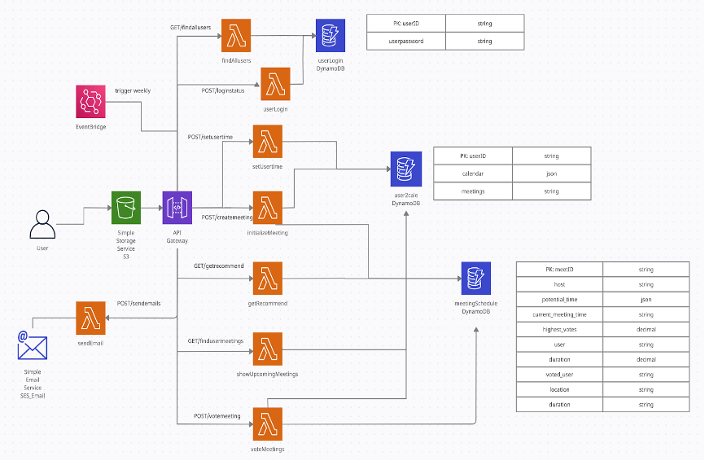
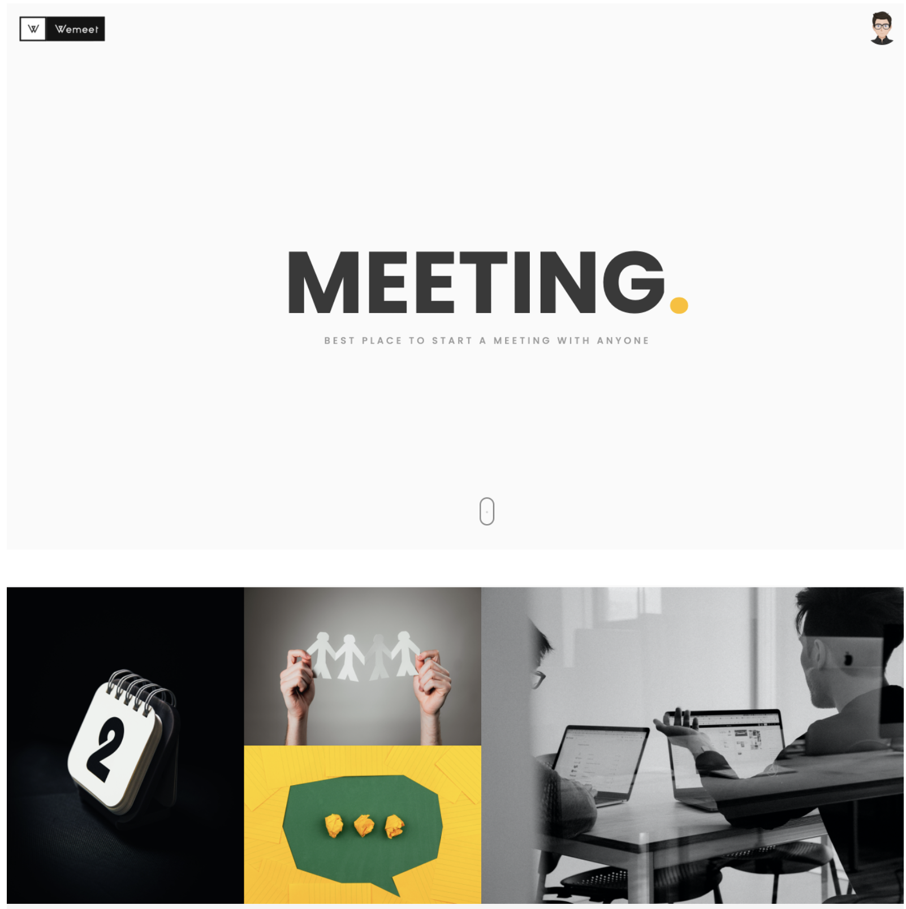
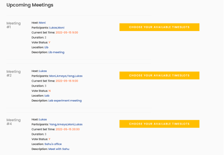
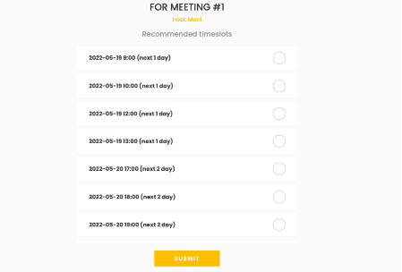
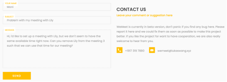

# Project for COMS 6998 Cloud Computing

> Author：Jiaqing Chen, Lukas Wang, Wannuo Sun, Yang Li

This project is for Columbia University COMS 6998 Cloud Computing course. We built an AWS-based meeting planner web application to help people schedule their team meeting. We recommend timeslots based on people's own calendar to intelligently avoid time conflicts among all meeting members.
- Backend: AWS
- Frontend: HTML + CSS + JavaScript

#### Architecture

#### Demo

